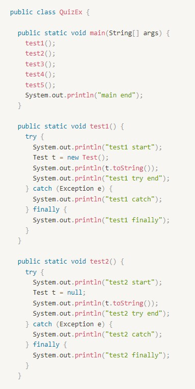
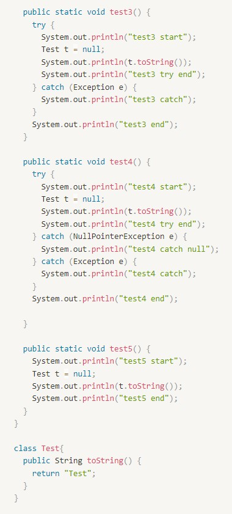

# 출력 결과 예측하기.
출력된 결과가 뭐가 나올지 텍스트로 작성해서 보내주세요~
(*예외/오류 메시지가 발생한다면, 정확한 메시지를 모르면
그냥 대강 ****오류 메시지 뜨는 곳**** 으로 표기)

## test1
test1 start
Test
test1 try end
test1 finally

## test2
test2 start
test2 catch
test2 finally

## test3
test3 start
test3 catch
test3 end

## test4
test4 start
test4 catch null
test4 end

## test5
test5 start
**NullPointerException**